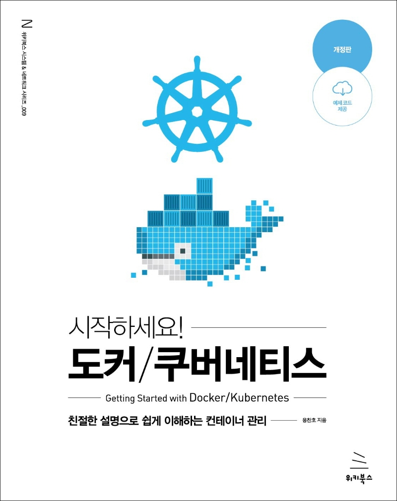

# start-docker-kubernetes
도커/쿠버네티스 스터디  
기간 : 12 ~ 14주  
시간 : 매주 주말 
스터디원 : 6~9명  

## 책 정보
[책 링크 (개정판이 있습니다 웬만하면 개장판으로 구매해주세요) ](http://www.kyobobook.co.kr/product/detailViewKor.laf?mallGb=KOR&ejkGb=KOR&barcode=9791158392291#N)

## 목표
시작하세요! 도커/쿠버네티스 책 완독

## 진행
- 1주동안 읽을 분량을 정하고 매주 모임(온라인) 전 까지 읽고 내용을 정리하여 PR을 올립니다.
  - 내용 정리는 편하신대로 작성해주시면됩니다 ( 양식 제한 없음 : 인증사진만 올려도 괜찮음)
    - 각자 내용 작성할 개인 directory를 docker package안에 만들어주시고 생성한 개인 directory에 지속적으로 올려주시면됩니다.
    - 주차별 인증은 PR로 올려주시면됩니다. ( [Meet-coder 도커 Repository 바로가기](https://github.com/Meet-Coder-Study/start-docker-kubernetes) fork후 개인 Repository에서 요청)
  - 매주 모임에서는 30분 ~ 1시간 정도로 공부한 내용 공유 및 다음 스터디 분량을 정합니다
- 분량은 매주 총 50Page 내외로 정할 예정이고 세세한 분량 조절은 매주 모임에서 결정 합니다.
- 분량을 채우지 못했다면 다음 모임까지 읽고 참여 해주세요! 
- 분량은 스터디 진행하면서 조절될 수 있습니다 (스터디원 분들의 의견에 따라)

## 보증금 및 벌금
- 보증급 및 벌금은 운영 하지 않습니다.  
- 3~5주 정도 인증 PR, 아무 연락없이 미참여시 참여가 불가능 할수도 있습니다.  

## 주의사항
- 600페이지의 분량을 12~14주 일정으로 소화하기 때문에 꾸준한 참여가 필요합니다. 
  - 매주 분량을 다 못채워도 꾸준히 참여하실분들만 참여주세요! ( 분량은 매주 이야기 하여 조절할 계획입니다. )
- 모임 참여 불가능 하실 때는 미리 ( 스터디 당일 아침까지 ) 말씀을 해주세요!
- 첫 스터디 진행이기 때문에 불만사항이 있으시면 언제든지 말씀해주세요!
