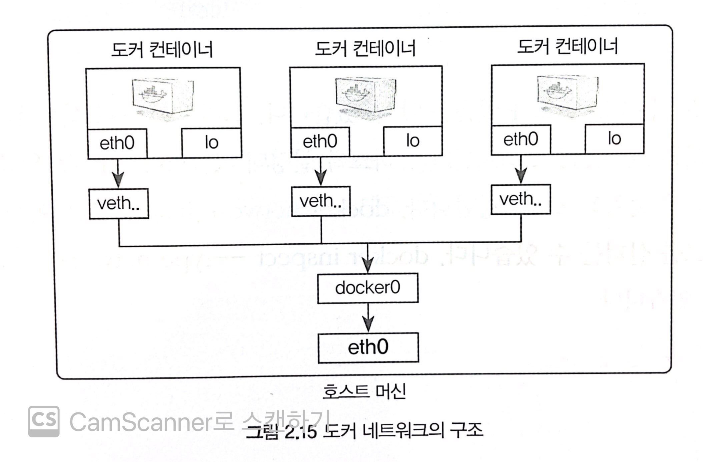

# 도커/쿠버네티스 1주차
## 도커 설치
- uname -r : 3버전 이상이여야 함
- sudo curl -fsSL [https://download.docker.com/linux/ubuntu/gpg](#)(https://download.docker.com/linux/ubuntu/gpg) | sudo apt-key add -
- sudo add-apt-repository "deb [arch=amd64](#) [https://download.docker.com/linux/ubuntu](#)(https://download.docker.com/linux/ubuntu) $(lsb_release -cs) stable"
- sudo apt-get update
- sudo apt-get install docker-ce
- docker -v : 설치확인

## sudo 없이 docker 명령어 쓰기
- sudo usermod -aG docker \<현재 유저이름\>
	- 현재 유저이름 확인 : whoami했는데 `docker: Got permission denied while trying to connect to the Docker daemon socket at unix:///var/run/docker.sock: Post "http://%2Fvar%2Frun%2Fdocker.sock/v1.24/containers/create": dial unix /var/run/docker.sock: connect: permission denied` 에러뜨면 **sudo chmod 666 /var/run/docker.sock** 로 해당 파일 권한을 변경시켜주면 된다.

## 도커 컨테이너 기본 명령어
- 기본적으로 run 사용하지만, create도 가능하다.
	- run : 실행된 컨테이너 내부로 들어감

- exit : 컨테이너 정지시키고 쉘에서 빠져나옴
- control + P,Q : 컨테이너 유지시키고 빠져나옴
- docker rm -f $(docker ps -a -q) : 실행중인 컨테이너 모두 바로 삭제
## 컨테이너 어플리케이션 구축
- mysql 설치 :
`docker run -d --name wordpressdb -e MYSQL_ROOT_PASSWORD=hcshcs -e MYSQL_DATABASE=wordpress mysql:5.7`
- WordPress 설치 : 
`docker run -d -e WORDPRESSDBHOST=mysql -e WORDPRESSDBUSER=root -e WORDPRESSDBPASSWORD=hcshcs --name wordpress --link wordpressdb:mysql -p 80 wordpress`
- `-d` vs `-it` : -d는 백그라운드로 실행해야하는 컨테이너들 mysql,springboot 등등,-it는 쉘에 접속해 명령어를 입력하고 상호 입출력이 필요한 컨테이너들에 옵션 추가
- 그러면 -d 옵션으로 실행된 백그라운드 컨테이너들의 쉘에는 어떻게 접근할까?`docker exec -it wordpressdb /bin/bash`사용해서 접근 후 빠져나오면 된다.

## 도커 볼륨
- 쉽게 이해하자면 실행된 도커 컨테이너의 데이터를 영속적으로 사용하기 위한 방식들
### 호스트 볼륨 공유 방식
`docker run -d --name wordpressdb_hostvolume -e MYSQL_ROOT_PASSWORD=password -e MYSQL_DATABASE=testDb -v /home/test_db:/var/lib/mysql mysql:5.7`우선 mysql 컨테이너 하나를 호스트 볼륨 공유 방식으로 실행시킵니다.궁금한점이 호스트에서 컨테이너의 배쉬와 공유하는 디렉토리에 파일을 읽거나 쓰면 컨테이너의 배쉬 저장소에 반영이 될까요?

위의 사진은 실제 호스트 스토리지입니다.테스트를 위해 **test.txt**를 호스트에서 생성했습니다.

실제로 docker exec 통해 컨테이너의 배쉬에서 확인해보면 호스트에서 생성한 **test.txt**이 존재하는것을 볼 수 있습니다.
호스트 볼륨 방식은 컨테이너에서 **공유할 디렉토리가 호스트에 존재하는 경우**와 **그렇지 않은경우**로 나누어서 확인해봐야합니다.후자의 경우 컨테이너-\>호스트로의 디렉토리 복사가 이루어집니다.반면 전자의 경우 호스트 -\> 컨테이너로 디렉토리를 복사가 진행됩니다.
### 볼륨 컨테이너 방식
볼륨을 사용하는 컨테이너를 다른 컨테이너와 공유하는 방식입니다.`호스트 볼륨 방식에서 진행한 컨테이너처럼 -v 옵션을 사용한 컨테이너를 다른 컨테이너와 공유하는것`입니다.
### 도커 볼륨 방식
도커 자체에서 제공하는 볼륨 기능을 활용해 데이터를 보존하는 방식입니다.
1)`docker volume create --name myvolume`을 통해 도커 볼륨을 생성하고
2)`docker volume ls`를 통해 확인가능합니다.아래 결과를 보면 사용자가 직접 만들지 않은 여러가지 볼륨이 있는데 이는 -v 옵션을 통해 볼륨을 공유하게 될 경우 자동으로 생성됩니다.

만약 생성된 볼륨들을 모두 삭제하고 싶은 경우에는 `docker volume prune`를 통해 전부 삭제할 수 있습니다.볼륨의 경우 컨테이너를 지운다고 해도 자동으로 삭제되지 않기에 불필요한 볼륨이 남아있을 확률이 높습니다.

## 도커 네트워크
우선 docker를 실행중인 ec2 서버에서 ifconfig로 현재 네트워크 구성을 봅시다.생소한 구성이 존재합니다.docker0와 veth로 구성된 네트워크 인터페이스가 존재합니다.이들은 도커를 사용하기 위해 필요한 네트워크 인터페이스들입니다.

아래 사진과 같이 docker0의 경우 veth를 eth0과 이어주는 브릿지 역할을 수행하고 있습니다.그리고 veth의 경우 현재 실행중인 각각의 컨테이너들이 사용중인 인터페이스라고 이해하시면 됩니다.참고로 eth0는 제가 사용하는 ec2가 취하고 있는 네트워크 인터페이스입니다.이더넷을 사용한다는 뜻입니다.
그러면 도커 컨테이너 내부에서도 호스트 서버와 통신을 해야하니 네트워크 인터페이스들이 작동하고 있습니다.아래 경우처럼 컨테이너의 eth0 인터페이스는 호스트의 veth 인터페이스와 연결 되어 외부와 통신을 할 수 있습니다.
